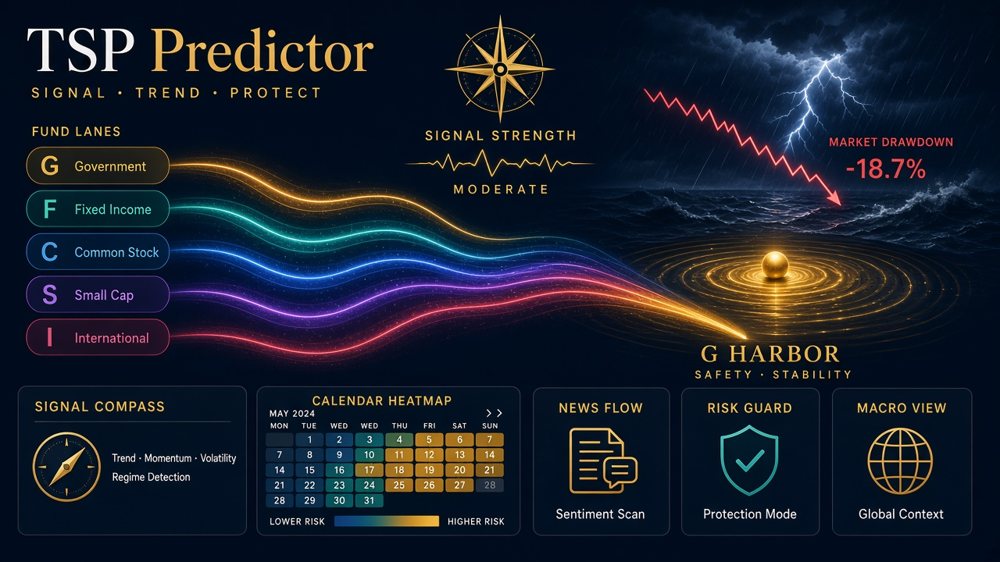

# TSP Predictor

TSP Predictor is a local, educational tool that turns Thrift Savings Plan share prices into a walk-forward record of simple allocation rules and two statistical models. It is decision support for learning how those rules would have behaved under the real interfund-transfer limit.

It is not financial advice. It does not log into a TSP account, place trades, or promise an outcome. A signal is shown next to its out-of-sample record against buy-and-hold C, L 2050, always staying in G, and a static 60% C / 40% G mix. When the point estimate is below a baseline, the page says so.

## Quick start

Python 3.12 is required. From a checkout:

```bash
python3.12 -m venv .venv
source .venv/bin/activate
pip install -r requirements.lock
pip install -e .
tsp build
tsp serve
```

Open the address the server prints. It listens on 127.0.0.1 only.

`tsp build` reads `data/snapshot/` and writes `dist/`. It does not need a network. The first build fits the walk-forward models and is the slow step.

Optional refresh of the TSP.gov files (one download per file, at most once per Eastern calendar day unless `--force`):

```bash
tsp update
tsp update --extras          # Tier B/C files into data/cache/, which is gitignored
tsp update --extras --news   # also the optional GDELT tone file
```

If validation fails, the previous snapshot is left in place.

Optional local check, for cron or Task Scheduler. It only writes `dist/data/alert.json` and `data/user/last_signal.json`:

```bash
# cron, weekdays at 7:00 Eastern is a local choice; this example is 11:00 UTC
0 11 * * 1-5 cd /path/to/TSPPredictor && /path/to/TSPPredictor/.venv/bin/tsp check
```

Windows Task Scheduler: a daily task whose program is the `tsp` executable and whose argument is `check`, starting in the repository directory.

A decision journal on disk:

```bash
tsp journal add --date 2026-10-06 --fund C --reason "held the lifecycle fund" --confidence 0.4
```

That file is `data/user/journal.jsonl`. The dashboard keeps a separate journal in the browser's local storage, with export and import.

## Rules the engine models

Sources: [how to change TSP investments](https://www.tsp.gov/how-to-change-your-tsp-investments/), [5 CFR 1601.32](https://www.ecfr.gov/current/title-5/section-1601.32), [share-price calculation](https://www.tsp.gov/share-price-calculation/), and the [April 24, 2008 Federal Register](https://www.govinfo.gov/content/pkg/FR-2008-04-24/html/E8-8957.htm) notice of the two-per-month limit, effective May 1, 2008. The text snapshots live in `data/snapshot/rules/`.

- Each calendar month, an account gets two unrestricted interfund transfers, counted on the **posting date**. Civilian and uniformed accounts are separate.
- A request before noon Eastern on a TSP business day posts that day. A request at noon or later, or on a closed day, posts the next TSP business day. A request after noon on the last business day of a month posts next month and counts against that next month.
- After two unrestricted transfers, a later request is accepted only when it does not decrease G and does not increase F, C, S, or I. A move to 100% G qualifies. So does a partial move that only raises G. Rejected requests do not count. Extra G-only moves after the limit do not increase the unrestricted counter. The first two transfers count even if they move into G.
- The price applied is the posting-date close. There is no fee for these moves. The Mutual Fund Window is out of scope.
- The initial allocation in a backtest is an investment election. It does not consume a transfer or the execution lag. Later changes do.
- Default execution lag is one TSP session. A signal at the close of day t posts at the close of t+1 and earns its first return on t+2. Lag 2 is the after-noon case. The engine never earns the new mix on the signal day.
- Historical business days are the dates in the share-price file. That file is closed on Columbus Day and Veterans Day, and it also omits some NYSE-only closures. Dates after the last price are a **projected** calendar: weekdays, minus NYSE holidays, plus Columbus Day and Veterans Day.

The limit exists to discourage frequent trading. The app is for looking at a record, not for generating more transfers.

## Data

| Tier | What | Where | License / note |
| --- | --- | --- | --- |
| A | TSP daily share prices (2003–2026), monthly and annual returns (1987–2026), retired L funds, 56 cited events, Fed H.15, BLS CPI and unemployment, Caldara-Iacoviello GPR, NBER dates, rule texts | `data/snapshot/`, committed | TSP.gov public pages; H.15 and BLS public series; GPR is CC BY (Caldara and Iacoviello, 2022, American Economic Review); NBER public dates. See `data/snapshot/SOURCES.md`. |
| B | FRED exploration copies, Fama-French, Shiller, NY Fed recession probabilities | `data/cache/` only, gitignored | FRED's machine-learning terms do not allow training models on FRED. Fetchers save a note and the trainers do not read those files. NY Fed probabilities are forward-dated and, if used, are shifted back 12 months. |
| C | Cboe VIX | `data/cache/` only, gitignored | Local use. If the file is absent, `vol_level` is 20-session realized volatility of the C Fund. |

`MANIFEST.csv` lists Tier B and C paths that are not in the snapshot. Missing paths are expected. A hash mismatch on a file that is present is an error.

BLS CPI and unemployment for 2025-10 are blank in the bundled file (the statistical-agency gap). The pipeline does not interpolate that month. The 2026 annual row is a partial year through 2026-09.

NBER recession dates are an evaluation flag only. They are not model features.

## Methodology

Features at date t use prices through the close of t and macro releases dated as available by t. CPI is treated as available on the 15th of the following month, unemployment on the 8th, H.15 on the next weekday, and the daily GPR index one calendar day later. Scalers, calibration, and the small hyperparameter search are fit inside each training fold.

The label is the fund with the highest excess return over G across the next h sessions, starting after the lag. h is 21 sessions on the daily cadence and 1 month on the monthly cadence. A 63-session daily horizon is also scored at lag 1. G wins when every risky excess is negative. Funds that do not exist yet are ignored.

Models, in the same backtester:

- Buy-and-hold C, L 2050 (only where it has a price), always G, a static 60/40 mix, and a monthly rebalance of that mix.
- Rules: 10-month moving average, dual momentum, yield curve plus trend, a volatility target, and Sell-in-May as a straw man.
- L2 logistic regression, multinomial over G, F, C, S, and I.
- HistGradientBoosting with shallow trees. The 63-session run skips this model to keep the build short; the 21-session and monthly runs include it.
- An ensemble that averages the calibrated logistic probabilities, the boosting probabilities, and the best rule. The rule's probability is its hit rate on the purged past. The best rule is chosen from that same past.

Walk-forward uses an expanding window of at least five years, refit monthly (daily models) or annually (monthly models). Training labels whose price window reaches the test date are purged, and another h+lag decision rows are embargoed. Sigmoid calibration uses the last year of the fold. Every configuration is written to `dist/data/trials.json`. That count enters the deflated Sharpe ratio (Bailey and López de Prado, 2014).

A verdict is **Beat** only when excess compound growth is positive, the 90% block-bootstrap interval lies entirely above zero, and the deflated Sharpe is at least 0.95. **Underperformed** means the point estimate is negative and the interval lies entirely below zero. Everything else is **Inconclusive**. A negative point estimate is still stated in words when the verdict is Inconclusive.

Why timing usually loses: the independent record assembled by Barfield Financial for 2019 did not show the tracked TSP allocation services ahead of simply holding the C Fund, and many advertised records are backtests rather than live results. Morningstar's 2025 Mind the Gap study found that investor timing subtracted about 1.2 percentage points a year from fund returns over the decade through 2024. This project is a way to test an idea against those baselines with the transfer rule enforced.

## Privacy

Nothing is transmitted. There is no account, no telemetry, and no API key in the repository. A balance and a retirement year, if you type them, stay in the browser's local storage. `tsp journal add` and `tsp check` write under `data/user/`, which is gitignored, along with `data/cache/` and `.env`. Dollar figures on the page are labeled hypothetical and default to $100,000.

## Limitations

- Macro series are the latest vintage, not the first print that was available on the day.
- Daily history starts in 2003. Monthly history starts in 1987. S and I start in 2001. L 2050 starts in 2011.
- The I Fund's benchmark change on 2024-10-30 is flagged, and buy-and-hold I is reported before and after that date. Fair-value pricing means a one-day reversal rule on I is not a tradable edge; the diagnostic flags the toy version of that rule.
- Event studies have small samples. Each event is different.
- Regime labels, including the optional Gaussian mixture, describe the past. They are not a forecast.
- Turn-of-month and pre-holiday flags follow a scheduled calendar, so an unscheduled closure can disagree with the price file.
- The cover and the UI reference sheet in `docs/` follow the art direction for this project. The dashboard itself is HTML, CSS, and SVG, not a screenshot.
- Click is pinned to 8.1.8. Typer 0.12.5 treats options that take a value as flags on Click 8.2 and later, which breaks `tsp serve --port` and `tsp journal add`.

## Adding headlines or events

Headlines, optional and off unless the file exists:

```text
data/user/headlines.csv
date,headline
2026-03-02,Markets reopen after a weekend headline
```

The tone features lag one day and are not in the default model matrix.

Events belong in `data/snapshot/events.csv` with a unique `event_id`, a `category`, a `first_reaction_tsp_date` on a real TSP session, and an `https://` `source_url`. Rebuild after editing. Do not add an event whose reaction date you only know with later information if you want the study to stay point-in-time.

## UI reference

The component sheet used for color, badges, the gauge, and the explanation card is `docs/ui-art-reference.jpg`. The transfer meter in the app shows two unrestricted transfers and then G-only. It does not show a six-transfer budget.
